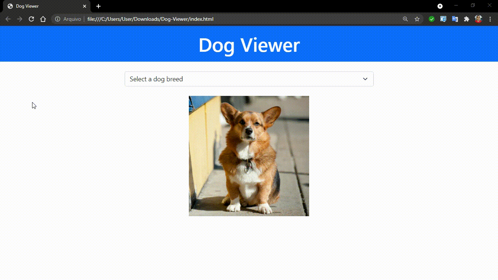

<h1 align="center">Dog Viewer 🐶</h1>

Mini-projeto desenvolvido para explorar requisições a API's no Javascript

  

<h3 align="center"> Status: Concluido ✅</h3>

 <a href="#demonstracao">Demonstração</a> •
 <a href="#tecnologias">Tecnologias</a> •
 <a href="#autor">Autor</a>

<h2 align="center" id="demonstracao">Demonstração</h2>

<h2 align="center" id="tecnologias">⚒️ Tecnologias</h2>

<h3> O projeto foi desenvolvido utilizando: </h3>

<ul>
  <li>HTML5</li>
  <li>CSS3</li>
  <li>Bootstrap</li>
  <li>Javascript (Fetch API - scripts.js e AJAX - ajax.js)</li>
</ul>

<h2 align="center" id="autor">Autor</h2>

Desenvolvido por Guilherme Santos

